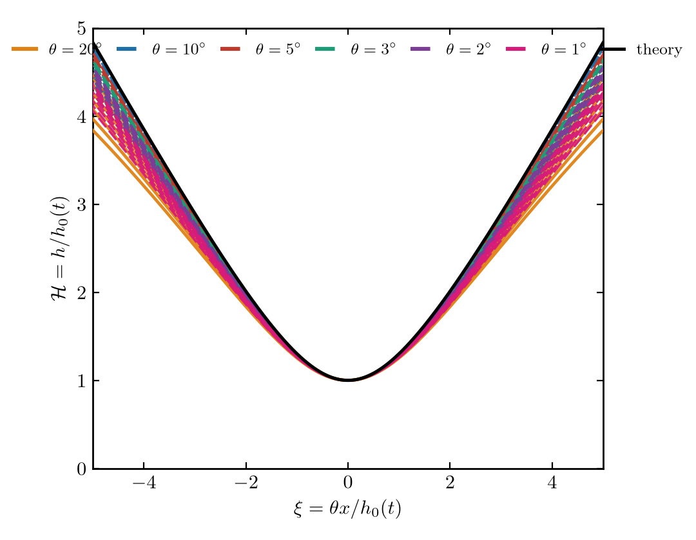
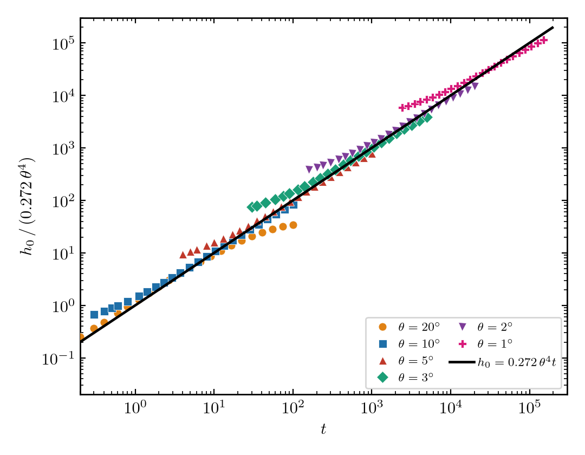

# Clean sessile-drop coalescence — self-similar bridge dynamics

The **clean** (`beta = Pe = 0`, surfactant-free) limit of the sessile-drop
lubrication model in this repository. Two viscous spherical-cap drops sit on a
substrate, meet at a microscopic bridge, and the capillary-driven neck grows
self-similarly. This folder contains a parametrized solver, a data-reduction
step, a similarity-ODE solver, and two demonstration plots.

## Physics

In the viscous lubrication limit the neck height grows linearly,

```
h0(t) = 0.272 theta^4 t ,
```

and, written in the measured-neck-height variables

```
H = h / h0(t) ,   xi = theta x / h0(t) ,
```

the whole bridge profile collapses onto a single self-similar **master curve**
`H(xi)`, independent of time and contact angle — the early bridge forgets its
initial geometry. Reference: J. F. Hernández-Sánchez, L. A. Lubbers, A. Eddi &
J. H. Snoeijer, *Symmetric and asymmetric coalescence of drops on a substrate*,
Phys. Rev. Lett. **109**, 184502 (2012),
[arXiv:1207.2635](https://arxiv.org/abs/1207.2635).

## Similarity ODE and master curve

Substituting `h = h0(t) F(eta)`, `eta = x/w`, `h0 = c theta^4 t`, `w = h0/theta`
into the clean lubrication equation `h_t = -(h^3 h_xxx / 3)_x` makes the explicit
time dependence cancel and gives the autonomous similarity ODE

```
(F^3 F''')' = 3 c (eta F' - F) ,
F(0)=1, F'(0)=0, F'''(0)=0,   F'(inf)=1, F''(inf)=0 .
```

`F(eta) = H(xi)` is the master curve. `similarity_solution.py` solves it by
shooting: fixing `c = 0.272` (the simulation value) and matching the unit-slope
wedge pins the neck curvature `F''(0) = 0.6607` with `F''(inf) ≈ 0`
(|F''| < 4e-3), confirming `0.272` is the eigenvalue of the boundary-value
problem. Running it writes `similarity_master.csv`.

## Self-similar collapse



## Neck-height law



## Pipeline

```
coalescence_clean.py   ->  reduce_clean.py   ->  plot_collapse.py / plot_neck_law.py
(pyoomph simulation)       (snapshots -> npz)    (figures)
similarity_solution.py ->  similarity_master.csv ----^   (theory curve)
```

1. **Simulate** one contact angle:
   `python coalescence_clean.py --theta-deg 10 --t-end 100 --outstep 0.1`.
   Writes `coalescence_clean_theta10/domain/domain_*.txt` (columns `x, h, p`).
2. **Reduce**: `python reduce_clean.py coalescence_clean_theta10 10 data/theta10.npz`
   stores the bridge-history profiles, the self-similar-window snapshots in
   `(xi, H)`, and the full neck history `h0(t)`.
3. **Theory**: `python similarity_solution.py` writes `similarity_master.csv`.
4. **Plot**: `python plot_collapse.py` and `python plot_neck_law.py`.

## Representative run parameters

All runs: precursor `hp = 1e-4`, domain `[-3, 3]`, base mesh `N = 5000`. Small
angles need much longer end-times because the self-similar onset scales as
`hp/(0.272 theta^4)` (≈ 0.025 for 20° but ≈ 4000 for 1°).

| theta | refine | t_end   | outstep | maxstep |
|------:|:------:|--------:|--------:|--------:|
| 20°   | 6      | 100     | 0.1     | 50      |
| 10°   | 6      | 100     | 0.1     | 50      |
| 5°    | 7      | 1000    | 1.0     | 50      |
| 3°    | 7      | 5000    | 5.0     | 200     |
| 2°    | 7      | 20000   | 20.0    | 500     |
| 1°    | 7      | 150000  | 150.0   | 2000    |

A grid-refinement check (`theta = 10°`, `N = 5000 -> 8000`, refine `6 -> 9`)
showed the collapse is already mesh-converged; the residual wing spread is
physical (self-similarity holds only for `xi << theta/h0`), not numerical.

## Files

| file | role |
|------|------|
| `lubrication_clean.py`     | thin-film (lubrication) equations for pyoomph |
| `coalescence_clean.py`     | parametrized pyoomph driver (one contact angle per run) |
| `reduce_clean.py`          | snapshots -> compact `.npz` bundle |
| `similarity_solution.py`   | shooting solver for the similarity master curve |
| `similarity_master.csv`    | precomputed master curve `(xi, H)` |
| `plot_collapse.py`         | self-similar collapse `H(xi)` + theory |
| `plot_neck_law.py`         | compensated neck-height law, all angles |
| `data/theta*.npz`          | reduced runs (`theta = 1…20°`) |

## Dependencies

- Simulation: [`pyoomph`](https://pyoomph.github.io).
- Reduction / plots: `numpy`, `matplotlib`, `scipy` (similarity ODE only).
